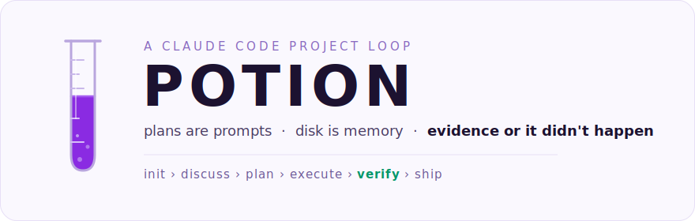
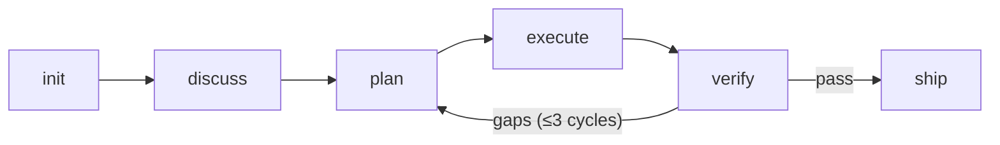
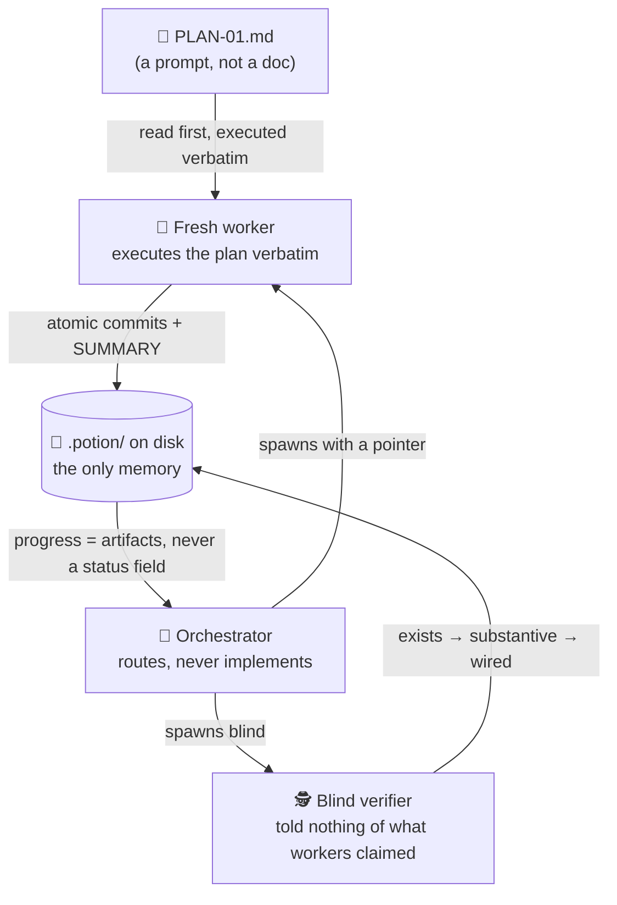

<div align="center">

<picture>
  <source media="(prefers-color-scheme: dark)" srcset="assets/hero-dark.svg">
  
</picture>

<br/>

[](LICENSE) [](https://github.com/Ian-Louw/potion/releases)    

</div>



Plus utilities: `/potion:pause` · `/potion:resume` · `/potion:learn` ·
`/potion:investigate` · `/potion:pair` · `/potion:update` — and **`/potion:brew`** runs the whole crank
end-to-end, stopping only at human gates.

**Thirteen skills. Two agents. Four hooks.** No ceremony. Potion brews
itself — every release was developed in a potion-managed repo, and it
red-teamed its own verifier with five seeded defects. It caught all five.

## ⚡ Why

A lean project framework distilled from the best of
[GSD](https://github.com/gsd-build/get-shit-done),
[Superpowers](https://github.com/obra/superpowers), and gstack — minus their
combined ~1MB of ceremony. Each got one thing profoundly right:

| Framework | ✅ Kept | ❌ Cut |
|---|---|---|
| **GSD** | ✅ durable disk state<br/>✅ goal-backward planning<br/>✅ mechanical verification | ❌ 27 commands<br/>❌ milestone bureaucracy<br/>❌ 625KB of prompts |
| **Superpowers** | ✅ skill-writing craft<br/>✅ Iron Laws, rationalization counters | ❌ ceremony on trivial tasks |
| **gstack** | ✅ evidence-based verification<br/>✅ circuit breakers<br/>✅ compounding learnings | ❌ 48 skills<br/>❌ duplicated preambles |

Potion keeps the mechanisms and cuts the mass. Every skill is under ~150 lines.
Shared rules live in **one** core document. Enforcement lives in state files and
verification ladders, not in ALL-CAPS pleading.

## The five laws that matter most

(five of eleven — the full canon with rationale is in [PHILOSOPHY.md](PHILOSOPHY.md))

1. **The filesystem is the memory** (Law 1). Progress is derived from which artifacts exist,
   never from a status field. State can't drift when it's computed from disk.
2. **Plans are prompts** (Law 2). A PLAN.md is executed verbatim by a fresh agent. If a plan
   needs interpreting, it's a bad plan.
3. **Goal-backward beats forward** (Law 3). Don't ask "what should we build?" Ask "what must
   be TRUE when we're done?" — then derive what must exist and what must be wired.
4. **Evidence before claims** (Law 4). "Should work now" is not a state of the world.
   Confidence is not evidence. Run it, read the output, then speak.
5. **Less is more** (Law 10). One skill per failure mode. If a skill doesn't prevent a real,
   observed failure, it doesn't ship.

Full rationale in [PHILOSOPHY.md](PHILOSOPHY.md). Shared rules every skill inherits
are in [core/CORE.md](core/CORE.md).

## Quickstart: your first brew

Install the plugin (needs `node` on PATH):

```bash
/plugin marketplace add Ian-Louw/potion
/plugin install potion@potion
```

The toy project: a CLI guess-the-number game in Node — plain `stdin`, no
framework, so every step has a real command to run. Make it a repo (Potion
requires git — commits are its ground truth):

```bash
mkdir guess && cd guess && git init
```

**1. `/potion:init`** — answer a few questions about goals and scope. You get:

```
.potion/
├── PROJECT.md    # goals, key decisions, out-of-scope
└── STATE.md      # position digest — where you are, always current
```

**2. `/potion:discuss`** — lock the decisions before any planning. For the toy:
you decide "stdin interface, no deps" and it lands in DISCUSSION.md under
**Decisions** — from here on it's binding, not a suggestion an agent can drift
past.

**3. `/potion:plan`** — a goal-backward plan appears:

```
.potion/phases/01-core-game/
├── DISCUSSION.md
└── PLAN-01.md
```

The plan's frontmatter is its contract — `must_haves` lists what must be
**TRUE** when done, what must **EXIST** on disk, and what must be **WIRED**
together (the `key_links`).

**4. `/potion:execute`** — a fresh worker reads PLAN-01.md verbatim and runs
it: one atomic commit per task, deviations handled by four fixed rules. When
it finishes, `SUMMARY-01.md` appears next to the plan — the summary's
existence *is* the completion record; there is no status field to drift.

**5. `/potion:verify`** — the four-step protocol: deterministic checks, a
blind static audit (the auditor is told nothing about what the worker
claimed), runtime evidence, verdict. For the toy that means actually playing
a round of guess-the-number and saving the transcript:

```
.potion/phases/01-core-game/
├── PLAN-01.md
├── SUMMARY-01.md
├── VERIFICATION.md            # verdict: pass
└── evidence/
    └── 01-game-transcript.txt
```

`verdict: pass` — that's not the agent's opinion, that's the ladder.

From here, **`/potion:brew`** automates the crank — plan → execute → verify →
gap-cycle in one command, stopping only at human gates. Decisions stay yours:
brew refuses to run without a locked DISCUSSION.md.

## 🔁 Closed loops by design

Potion's phase cycle is a **closed loop** in the loop-engineering sense: a bounded
goal, an independent checker, durable state, and a human checkpoint — with budgets
and kill switches, not vibes:

| Loop layer | Potion mechanism |
|---|---|
| Contract | `must_haves` (truths / artifacts / key links) + locked decisions |
| State | `.potion/` — progress derived from artifacts on disk; strays route to fog, the decision queue, or the out-of-scope ledger — nothing evaporates; session continuity is rewritten whenever Position moves |
| Checker | blind verifier: deterministic checks first, then exists → substantive → wired; runtime proof lands in `evidence/` and VERIFICATION.md cites it by path; evidence only counts against a fresh build serving HEAD |
| Budgets | 3-strike fix breaker, 3-cycle gap-flywheel cap (counter on disk), quick-task ratchet |
| Human checkpoint | Rule 4 deviations, `human_needed` flags, ship gate |
| Ratchet | pitfalls promote to permanent `check` entries the verifier runs on every pass — each a POSIX-sh command with an exact `expect`, mechanically MATCH / MISMATCH / BROKEN; learnings travel forward too, delivered as keys in every worker's spawn digest |

And this is how the actors sit — the "plans are prompts" story, drawn:



> **Built with itself:** potion is developed in a potion-managed working
> repo — the loop above brewed every release in this changelog. A mischief
> audit then red-teamed the verifier itself: five classed defects seeded
> behind a sealed answer key — stub, wired-but-wrong, phantom commit,
> orphaned artifact, missing artifact. Caught 5/5, and it flagged the
> fabricated "verified live" claims unprompted.

The Operator Test governs everything: *if the agent cannot prove it is done,
you are not engineering a loop — you are automating drift.*

## 🧠 Knowledge that compounds

Every pass verdict harvests what the phase taught into an append-only journal —
and the knowledge keeps working after it's written:

- **Journal** — `.potion/learnings.jsonl`: append-only, newest-wins by key,
  never hand-edited. Ground truth.
- **Cross-repo promotion** — entries that clear the bar (confidence ≥ 8,
  generalizable, born inside the verified loop) promote to
  `~/.claude/potion/knowledge.jsonl`. What one repo learns, every repo knows.
  External text never crosses the boundary — only loop-born entries do.
- **Distillation pages** — journals distill into readable pages
  (`.potion/knowledge/`), each claim citing the journal entry it came from.
  Pages are a regenerable cache: when page and journal disagree, the journal
  wins and the page gets rebuilt.
- **Lint** — four hunts (contradictions, stale claims, orphans, coverage gaps)
  keep journal and pages honest. The safety line: cache fixes are automatic,
  truth changes are human-gated. Always.

Planners grep both journals into plans; workers get matching entry keys in
their spawn digest. Pitfalls with teeth promote to permanent `check` entries
the verifier runs on every pass.

## 📦 What's in the box

<details>
<summary>Repo layout — what ships in the plugin</summary>

```
potion/
├── core/CORE.md            # shared contract: voice, questions, evidence, statuses
├── skills/                 # init, discuss, plan, execute, verify, ship, brew,
│                           #   pause, resume, learn, investigate, pair, update
├── agents/                 # potion-worker (executor), potion-verifier (auditor)
├── hooks/                  # session-start (position + drift notices), secret/size
│                           #   scrubber, escalation approver, stop-drift nudge
├── templates/              # PROJECT.md, STATE.md, PLAN.md, RUNBOOK.md, SUMMARY.md,
│                           #   VERIFICATION.md, spec.md, verify-env.md, escalations.md,
│                           #   continue-here.md
└── PHILOSOPHY.md
```

</details>

State lives in your repo at `.potion/`:

<details>
<summary>The .potion/ state tree — every file, one line each</summary>

```
.potion/
├── PROJECT.md              # goals, locked decisions, out-of-scope (with why)
├── STATE.md                # <60-line digest: position, fog, decision queue, resume point
├── learnings.jsonl         # append-only insights, newest-wins
├── knowledge/              # distilled pages — regenerable cache over the journal
├── verify-env.md           # runtime session recipe, or `none-needed: <why>` — never absent
├── verify-env.local        # secret values for the recipe (gitignored)
├── specs/                  # current truth: GIVEN/WHEN/THEN per capability, merged on ship
├── continue-here.md        # transient pause file (deleted on resume)
└── phases/NN-slug/
    ├── DISCUSSION.md       # Decisions / Claude's Discretion / Deferred (+ gates)
    ├── PLAN-NN.md          # the prompt an executor runs verbatim
    ├── RUNBOOK-NN.md       # human-gate steps — a numbered peer of PLAN
    ├── SUMMARY-NN.md       # existence of this file = plan complete
    ├── VERIFICATION.md     # ladder results, structured gaps, tested SHA
    └── evidence/           # runtime proof artifacts + generated INDEX.md, cited by path
```

</details>

## Install

```bash
# from GitHub (Claude Code)
/plugin marketplace add Ian-Louw/potion
/plugin install potion@potion
```

Alternative: clone the repo and run `claude --plugin-dir path/to/potion` for a
zero-setup trial. Either way, install the whole plugin — do NOT copy `skills/`
alone into a skills directory: the shared contract in `core/`, the `templates/`,
`hooks/`, and `agents/` are load-bearing and only load through the plugin system.

Only runtime dependency: `node` on PATH (for the hooks).

## Credits

Standing on the shoulders of GSD, Superpowers, and gstack. Potion is a distillation,
not a replacement — if you want more machinery, those projects have it.

MIT licensed. Brewed with Claude Code.
